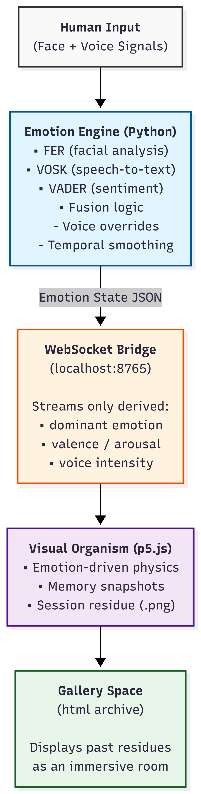

# Reflekt

Reflekt is a real-time hybrid intelligence system that transforms live biometric signals—facial expression and voice—into a continuously evolving visual organism.

The system does **not** attempt to classify or diagnose emotion. Instead, it fuses multiple weak signals into a transient emotional state that drives generative visuals and produces session-level visual residue.

This repository contains the full end-to-end pipeline: sensing, interpretation, fusion, streaming, rendering, and archival.

---

## System Overview

Reflekt is composed of three loosely coupled layers:

1. **Sensing & Interpretation** (Python)
2. **Real-time Bridge** (WebSocket)
3. **Visual Organism & Archive** (Browser)

Human input remains ephemeral. Only derived emotional state is streamed to the visual layer.

---

## Core Components

### Runtime Intelligence (Python)

- **reflekt_main.py**  
  Entry point. Launches the camera feeder, emotion engine, voice engine, and WebSocket bridge.

- **reflekt_emotion_live.py**  
  Asynchronous facial emotion analysis using FER with temporal smoothing, confidence grading, and fallback logic.

- **reflekt_voice_vosk.py**  
  Voice recognition using VOSK with sentiment analysis via VADER.  
  Includes semantic overrides (e.g., `"tired" → sad`) and dynamic valence/arousal estimation.

- **bridge_server.py**  
  Lightweight WebSocket server that streams **only** derived emotional state.  
  Raw audio, video frames, and transcripts are never transmitted.

---

### Visual Layer (Browser)

- **index.html**  
  Main interactive interface for the Reflekt organism.

- **sketch.js**  
  Emotion-responsive particle system (“The Liquid Soul”).  
  Visual behavior is driven by dominant emotion, valence, arousal, and voice intensity.  
  Supports memory snapshots and end-of-session residue export.

- **bridge.js**  
  Receives live emotional state from the Python backend via WebSocket.

- **gallery.html**  
  Immersive Three.js gallery that displays saved session residue images as a navigable archive.

---
## System Architecture
<p align="center">
  <a href="reflekt_diagram.png">
    
  </a>
</p>


---
## Interaction Model

- Facial input provides a continuous ambient signal.
- Voice input has priority and temporarily overrides facial inference.
- Emotional state is streamed in real time and is not stored.
- Persistence occurs only through:
  - Visual memory snapshots during the session
  - A final session residue image saved on termination

---

## Running Locally

### Prerequisites

- Python 3.9+
- Webcam and microphone
- A VOSK English model present in the project directory

---

### Install Dependencies

```bash
pip install fer vosk vaderSentiment sounddevice opencv-python websockets
```
### Start the backend
```bash
python reflekt_main.py 
```
--- 
### Launch the frontend 
Open index.html in a modern browser (Chrome recommended). 
To view the archive space, open gallery.html. 
---
## To End
Press ctrl + c
---
## Status
'What is art?' This question got me to create this... experiment?
This project is an experimental system intended for:

- Interactive installations
- Creative coding research
- Human–AI expression studies

##It is not a clinical, diagnostic, or surveillance tool!
##Hope you enjoy it!
